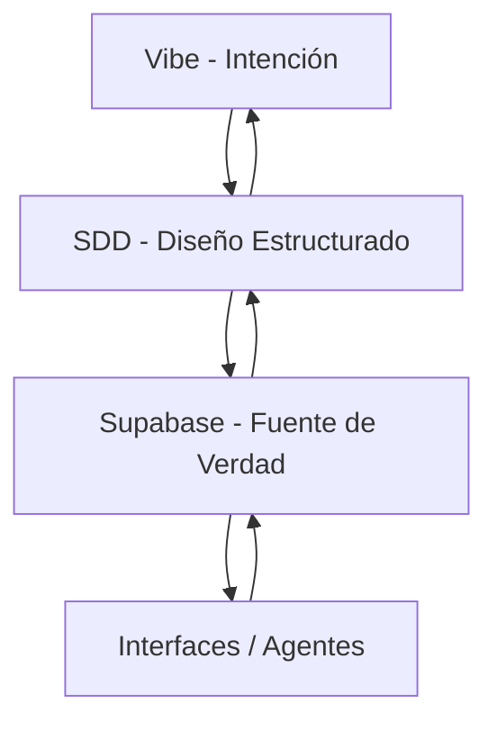

# Arquitectura en 4 Capas: Vibe → SDD → Supabase → Interfaces/Agentes

Este diagrama representa una arquitectura evolutiva donde la intención (Vibe) se transforma progresivamente en estructura formal (SDD), luego en modelo operativo (Supabase) y finalmente en experiencias y automatización (Interfaces/Agentes).

---

## 🧠 1. Vibe (Intención / Lenguaje Natural)

Es la capa de entrada conceptual.

- Ideas en lenguaje natural
- Objetivos de negocio
- Problemas a resolver
- Hipótesis de producto o proceso

**Salida:** intención estructurable

---

## 📐 2. SDD (System / Software Design Document)

Traduce la intención en estructura formal.

- Epics, features, user stories
- Reglas de negocio
- Modelo de datos conceptual
- Gobierno de datos (diccionario inteligente)

**Salida:** modelo lógico del sistema

---

## 🗄️ 3. Supabase (Fuente de Verdad Operativa)

Implementación del modelo en datos reales.

- Tablas y relaciones
- Políticas de acceso (RLS)
- Triggers y funciones
- Embeddings y metadatos semánticos

**Salida:** sistema operativo de datos

---

## 🧩 4. Interfaces / Agentes (Capa de Ejecución)

Consumo y acción sobre el sistema.

- Dashboards y apps (UI)
- APIs
- Agentes de IA
- Automatización de procesos

**Salida:** interacción y ejecución en tiempo real

---

## 🔄 Flujo General del Sistema



---

## 🔁 Característica Clave del Modelo

No es lineal. Es un sistema de retroalimentación continua:

- Los agentes generan datos → Supabase
- Supabase revela patrones → SDD
- SDD ajusta el diseño → Vibe
- Vibe redefine intención

---

## 💡 Lectura Estratégica

Este modelo funciona como un **sistema operativo de negocio vivo**, donde:

- El conocimiento no se documenta, se ejecuta
- El diseño no se fija, evoluciona
- Los datos no se consultan, se activan

---

Si querés, el próximo paso puede ser:
- Convertir esto en un **framework implementable en Supabase (tablas + embeddings + governance)**
- O bajarlo a un **MVP técnico con stack real (LLM + API + DB + UI)**


---

## 🧱 5. Supabase – Modelo de Datos Implementable (Paso 1)

Esta sección traduce la capa **SDD → Supabase** en un modelo real de datos orientado a ejecución, versionado y trazabilidad del sistema.

### 🧩 5.1 Entidades principales

#### 1. vibe_intents
Captura la intención original del sistema.

- id (uuid)
- title (text)
- description (text)
- raw_input (text)
- context (jsonb)
- created_at (timestamp)

Relación:
- 1 Vibe → N SDDs

---

#### 2. sdd_documents
Documento estructurado derivado de Vibe.

- id (uuid)
- vibe_id (fk)
- version (int)
- status (draft | approved | deprecated)
- objective (text)
- scope (text)
- created_at

Relación:
- 1 SDD → N epics

---

#### 3. epics
Bloques funcionales del sistema.

- id (uuid)
- sdd_id (fk)
- name (text)
- description (text)
- priority (int)

Relación:
- 1 Epic → N user_stories

---

#### 4. user_stories
Unidad ejecutable de funcionalidad.

- id (uuid)
- epic_id (fk)
- title (text)
- description (text)
- acceptance_criteria (jsonb)
- status (todo | doing | done)

---

#### 5. data_dictionary
Gobierno semántico del sistema.

- id (uuid)
- entity_name (text)
- field_name (text)
- data_type (text)
- description (text)
- is_required (bool)
- source (text)

---

#### 6. embeddings_store
Capa semántica para búsqueda inteligente.

- id (uuid)
- reference_type (vibe | sdd | epic | story)
- reference_id (uuid)
- embedding (vector)
- content (text)

---

#### 7. interfaces
Definición de vistas y canales de interacción.

- id (uuid)
- name (text)
- type (dashboard | api | agent | ui)
- config (jsonb)
- linked_sdd_id (fk)

---

#### 8. agents
Agentes de automatización y razonamiento.

- id (uuid)
- name (text)
- role (text)
- instructions (text)
- connected_interfaces (jsonb)

---

### 🔁 5.2 Relaciones clave

```text
vibe_intents → sdd_documents → epics → user_stories
                         ↓
                 data_dictionary
                         ↓
               embeddings_store
                         ↓
        interfaces / agents (consumo)
```

---

### ⚙️ 5.3 Principio estructural

- El **Vibe nunca se modifica directamente en ejecución**
- El **SDD es versionado y auditable**
- Supabase es la **única fuente de verdad operativa**
- Los embeddings permiten **conexión semántica transversal** entre capas

---

### 🚀 Resultado de esta capa

Este modelo convierte Supabase en:

> Un sistema operativo de negocio con trazabilidad completa desde intención → ejecución → aprendizaje

---

Siguiente paso posible:
- Definir **cómo Antigravity escribe y actualiza este modelo automáticamente (reglas de transformación Vibe → SDD → DB)**

